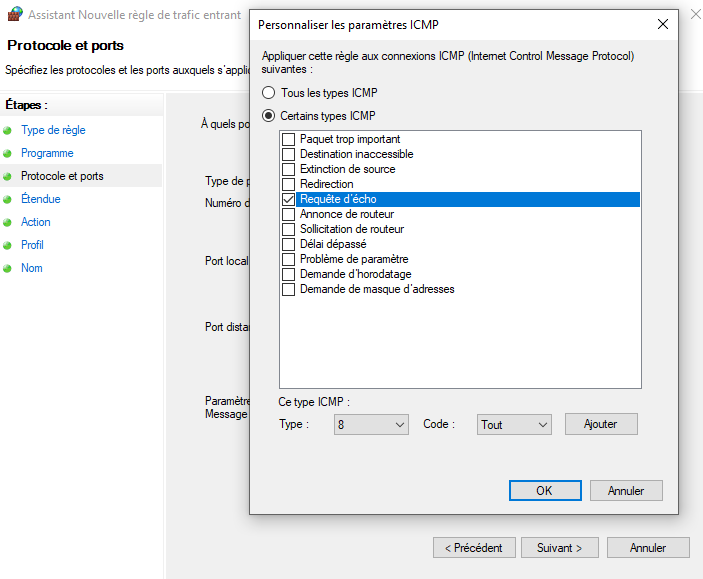
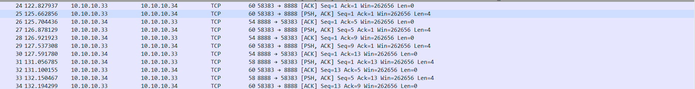
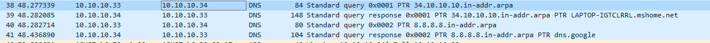

SOMMAIRE   
<Link to=5>lien</Link>
toc_max_heading_level: 5

# I. Exploration locale en solo (CHORT Maxime)
## 1. Affichage d'informations sur la pile TCP/IP locale
**🌞 Affichez les infos des cartes réseau de votre PC**
```powershell
ipconfig /all
```
**Réponse :** 
```powershell
PS C:\Users\Maxime> ipconfig /all
Carte réseau sans fil Wi-Fi :
   Description. . . . . . . . . . . . . . : MediaTek Wi-Fi 6 MT7921 Wireless LAN Card
   Adresse physique . . . . . . . . . . . : 34-6F-24-93-79-AD
   Adresse IPv4. . . . . . . . . . . . . .: 10.33.50.245
Carte Ethernet Ethernet :
   Description. . . . . . . . . . . . . . : Realtek PCIe GbE Family Controller
   Adresse physique . . . . . . . . . . . : 50-EB-F6-30-83-17
```
- Adresse IP pour la carte Ethernet : non

**🌞 Affichez votre gateway**   

```powershell
ipconfig
```
**Réponse :**
```powershell
PS C:\Users\Maxime> ipconfig
   Passerelle par défaut. . . . . . . . . : 10.33.51.254 
```
**🌞 Déterminer la MAC de la passerelle** 
```powershell
arp -a 10.33.51.254
```
**Réponse :**
```powershell
Adresse Internet      Adresse physique      Type
  10.33.51.254         7c-5a-1c-cb-fd-a4     dynamique
```
**🌞 Trouvez comment afficher les informations sur une carte IP (change selon l'OS)**  

[Panneau de configuration\Réseau et Internet\Centre Réseau et partage] Sélectionner le wifi puis cliquer sur "Détails"

- Adresse IP : 10.33.50.245
- Adresse MAC : 34-6F-24-93-79-AD 
- Gateway : 10.33.51.254

## 2. Modifications des informations 
### A. Modification d'adresse IP (part 1)
**🌞 Utilisez l'interface graphique de votre OS pour changer d'adresse IP :**


**🌞 Il est possible que vous perdiez l'accès internet.** Que ce soit le cas ou non, expliquez pourquoi c'est possible de perdre son accès internet en faisant cette opération.

**Réponse :** C'est possible de perdre l'accès car l'adresse IP est l'adresse de la machine sur le réseau local. Si l'adresse IP est changée, la machine ne sera plus reconnue sur le réseau local et donc ne pourra plus accéder à internet. Pour rester dans le même réseau, on peut modifier que le dernier octet pour rester dans le même réseau que la passerelle.

# II. Exploration locale en duo
## 3. Modification d'adresse IP
**🌞 Modification de nos adresses IP en utilisant le GUI (windows)**  

Adresse IP choisis :   10.10.10.33 et 10.10.10.34

  
**🌞 Vérifier à l'aide d'une commande que votre IP a bien été changée**
```powershell
ipconfig /all
```
**Réponse :**
```powershell
PS C:\Users\Maxime>ipconfig /all
Carte Ethernet Ethernet :
     Adresse IPv4. . . . . . . . . . . . . .: 10.10.10.34 (préféré)
```
**🌞 Vérifier que les deux machines se joignent**
```powershell
ping 10.10.10.33
```
**Réponse :**
```powershell
PS C:\Users\Maxime> ping 10.10.10.33
Statistiques Ping pour 10.10.10.33:
    Paquets : envoyés = 4, reçus = 4, perdus = 0 (perte 0%),
Durée approximative des boucles en millisecondes :
    Minimum = 3ms, Maximum = 6ms, Moyenne = 4ms
```
**🌞 Déterminer l'adresse MAC de votre correspondant**
```powershell
arp -a 10.10.10.33
```
**Réponse :**
```powershell
Interface : 10.10.10.33 
    Adresse Internet      Adresse physique      Type
     10.10.10.33           08-bf-b8-2d-af-1d     dynamique
```
## 4. Petit chat privé
**🌞 sur le PC serveur**  
```powershell
.\nc.exe -l -p 8888
```
**Réponse :**  
```powershell
PS C:\Users\Maxime\Documents\netcat-1.11> .\nc.exe -l -p 8888
```
*Il faut attendre que le client se connecte car aucune réponse*  
**🌞 sur le PC client**
```powershell
.\nc.exe 10.10.10.34 8888
```
**Réponse :**
Chat ouvert aves l'autre pc   

**🌞 Visualiser la connexion en cours**
```powershell
netstat -a -n -b | Select-String 8888 -Context 0,1
```
**Réponse :**
```powershell
PS C:\WINDOWS\system32> netstat -a -n -b | Select-String 8888 -Context 0,1

>   TCP    10.10.10.34:8888       10.10.10.33:58213      ESTABLISHED
   [nc.exe]
```

**🌞 Pour aller un peu plus loin**
```powershell
.\nc.exe -l -p 8888 -s 10.10.10.34
```
**Réponse :**  
```powershell
PS C:\WINDOWS\system32> netstat -a -n -b | Select-String 8888 -Context 0,1

>   TCP    10.10.10.34:8888       0.0.0.0:0              LISTENING
   [nc.exe]
```
## 5. Firewall
**🌞 Activez et configurez votre firewall**   
- **Autoriser les ping**  
Il faut ajouter une règle pour le ping   
  
Puis dire a qui cette règle doit s'appliquer  
  
Faire de même pour les règles de traffic sortant mais en lui autorisant la connexion  
```powershell
ping 10.10.10.34
```
**Réponse :**
```powershell
PS C:\Users\Maxime> ping 10.10.10.34

Envoi d’une requête 'Ping'  10.10.10.34 avec 32 octets de données :
Réponse de 10.10.10.34 : octets=32 temps=2 ms TTL=128
Réponse de 10.10.10.34 : octets=32 temps=2 ms TTL=128
Réponse de 10.10.10.34 : octets=32 temps=2 ms TTL=128
Réponse de 10.10.10.34 : octets=32 temps=2 ms TTL=128

Statistiques Ping pour 10.10.10.34:
    Paquets : envoyés = 4, reçus = 4, perdus = 0 (perte 0%),
Durée approximative des boucles en millisecondes :
    Minimum = 2ms, Maximum = 2ms, Moyenne = 2ms
```
- **Autoriser le traffic sur le port qu'utilise nc**  
Créer une règle de traffic entrant en type de règle port puis y inserer un port comme par exemple 8888  
Créer une règle de traffic sortant en type de règle port puis y inserer le port du traffic entrant et autoriser la connexion entre eux 

## 6. Utilisation d'un des deux comme gateway

**🌞Tester l'accès internet**   
```powershell
ping 1.1.1.1
```
**Réponse :**
```powershell
PS C:\Users\Maxime> ping 1.1.1.1

Envoi d’une requête 'Ping'  1.1.1.1 avec 32 octets de données :
Réponse de 1.1.1.1 : octets=32 temps=91 ms TTL=55
Réponse de 1.1.1.1 : octets=32 temps=64 ms TTL=55
Réponse de 1.1.1.1 : octets=32 temps=31 ms TTL=55
Réponse de 1.1.1.1 : octets=32 temps=14 ms TTL=55

Statistiques Ping pour 1.1.1.1:
    Paquets : envoyés = 4, reçus = 4, perdus = 0 (perte 0%),
Durée approximative des boucles en millisecondes :
    Minimum = 14ms, Maximum = 91ms, Moyenne = 50ms
```
**🌞 Prouver que la connexion Internet passe bien par l'autre PC**   
```powershell
tracert 10.10.10.34
``` 
**Réponse :**
```powershell
PS C:\Users\Maxime> tracert 10.10.10.34

Détermination de l’itinéraire vers 10.10.10.34 avec un maximum de 30 sauts.

  1     *        *        *     Délai d’attente de la demande dépassé.
  2     *        *        *     Délai d’attente de la demande dépassé.
  3     *        *        *     Délai d’attente de la demande dépassé.
  4     *        *        *     Délai d’attente de la demande dépassé.
  5     *        *        *     Délai d’attente de la demande dépassé.
  6     *        *        *     Délai d’attente de la demande dépassé.
  7     *        *        *     Délai d’attente de la demande dépassé.
  8     *        *        *     Délai d’attente de la demande dépassé.
  9     *        *        *     Délai d’attente de la demande dépassé.
 10     *        *        *     Délai d’attente de la demande dépassé.
 11     *        *        *     Délai d’attente de la demande dépassé.
 12     *        *        *     Délai d’attente de la demande dépassé.
 13     *        *        *     Délai d’attente de la demande dépassé.
 14     *        *        *     Délai d’attente de la demande dépassé.
 15     *        *        *     Délai d’attente de la demande dépassé.
 16     *        *        *     Délai d’attente de la demande dépassé.
 17     *        *        *     Délai d’attente de la demande dépassé.
 18     *        *        *     Délai d’attente de la demande dépassé.
 19     *        *        *     Délai d’attente de la demande dépassé.
 20     *        *        *     Délai d’attente de la demande dépassé.
 21     *        *        *     Délai d’attente de la demande dépassé.
 22     *        *        *     Délai d’attente de la demande dépassé.
 23     *        *        *     Délai d’attente de la demande dépassé.
 24     *        *        *     Délai d’attente de la demande dépassé.
 25     *        *        *     Délai d’attente de la demande dépassé.
 26     *        *        *     Délai d’attente de la demande dépassé.
 27     *        *        *     Délai d’attente de la demande dépassé.
 28     *        *        *     Délai d’attente de la demande dépassé.
 29     *        *        *     Délai d’attente de la demande dépassé.
 30     *        *        *     Délai d’attente de la demande dépassé.

Itinéraire déterminé.
```
# III. Manipulations d'autres outils/protocoles côté client
## 1. DHCP d'autres outils/protocoles côté client
**🌞Exploration du DHCP, depuis votre PC**
```powershell
ipconfig /all
```
**Reponse :**
```powershell
PS C:\Users\Maxime> ipconfig /all
Serveur DHCP . . . . . . . . . . . . . : 10.33.51.254
Bail expirant. . . . . . . . . . . . . : mardi 17 octobre 2023 13:43:39
```
## 2. DNS
🌞**Trouver l'adresse IP du serveur DNS que connaît votre ordinateur**
```powershell
ipconfig /all
```
**Réponse :**
```powershell
PS C:\Users\Maxime> ipconfig /all
Carte réseau sans fil Wi-Fi :
Serveurs DNS. . .  . . . . . . . . . . : 10.33.50.2
                                         8.8.8.8
```
**🌞 Utiliser, en ligne de commande l'outil nslookup**
- **Un lookup pour google.com**
```powershell
nslookup google.com
```
**Réponse :** 
```powershell
PS C:\Users\Maxime> nslookup google.com 8.8.8.8
Serveur :   dns.google
Address:  8.8.8.8

Réponse ne faisant pas autorité :
Nom :    google.com
Addresses:  2a00:1450:4007:818::200e
          142.250.178.142
```
- **Puis pour Ynov :** 
```powershell
nslookup ynov.com
```
**Réponse :**
```
PS C:\Users\Maxime> nslookup ynov.com 8.8.8.8
Serveur :   dns.google
Address:  8.8.8.8

Réponse ne faisant pas autorité :
Nom :    ynov.com
Addresses:  2606:4700:20::681a:be9
          2606:4700:20::681a:ae9
          2606:4700:20::ac43:4ae2
          104.26.11.233
          104.26.10.233
          172.67.74.226
```
Les deux domaines utilisent le même DNS 8.8.8.8 pour faire des requêtes  
L'adresse IP du serveur à qui on vient d'effectuer ces requêtes est 8.8.8.8
- **Un lookup pour l'adresse : 231.34.113.12**
```powershell
nslookup 231.34.113.12
```
**Reponse :** 
```
PS C:\Users\Maxime> nslookup 231.34.113.12 8.8.8.8
Serveur :   dns.google
Address:  8.8.8.8

*** dns.google ne parvient pas à trouver 231.34.113.12 : Non-existent domain
```
Le DNS de google ne connait pas le nom du domaine associé à cette adresse IP
- **Un lookup pour l'adresse : 231.34.113.12**
```powershell
nslookup 78.34.2.17
```
**Reponse :**
```powershell
PS C:\Users\Maxime> nslookup 78.34.2.17 8.8.8.8
Serveur :   dns.google
Address:  8.8.8.8

Nom :    cable-78-34-2-17.nc.de
Address:  78.34.2.17
```

Le DNS de google connait le nom du domaine associé à cette adresse IP qui est : cable-78-34-2-17.nc.de

# IV. Wireshark
**🌞 Utilisez le pour observer les trames qui circulent entre vos deux carte Ethernet. Mettez en évidence :**  
- **un ping entre vous et votre mate**
```powershell
ping 10.10.10.33
```
**Réponse :**
  
- **un ping entre vous et la passerelle du réseau**
```powershell
ping 10.10.10.34
```
**Réponse :**
  
- **un netcat entre vous et votre mate, branché en RJ45**
```powershell
.\nc.exe -l -p 8888 
.\nc.exe 10.10.10.34 8888
```
**Réponse :**

- **une requête DNS. Identifiez dans la capture le serveur DNS à qui vous posez la question.**
```powershell
nslookup 8.8.8.8 10.10.10.34
```
**Réponse :**

*Il faut poser la question a l'ordinateur qui possede internet*
